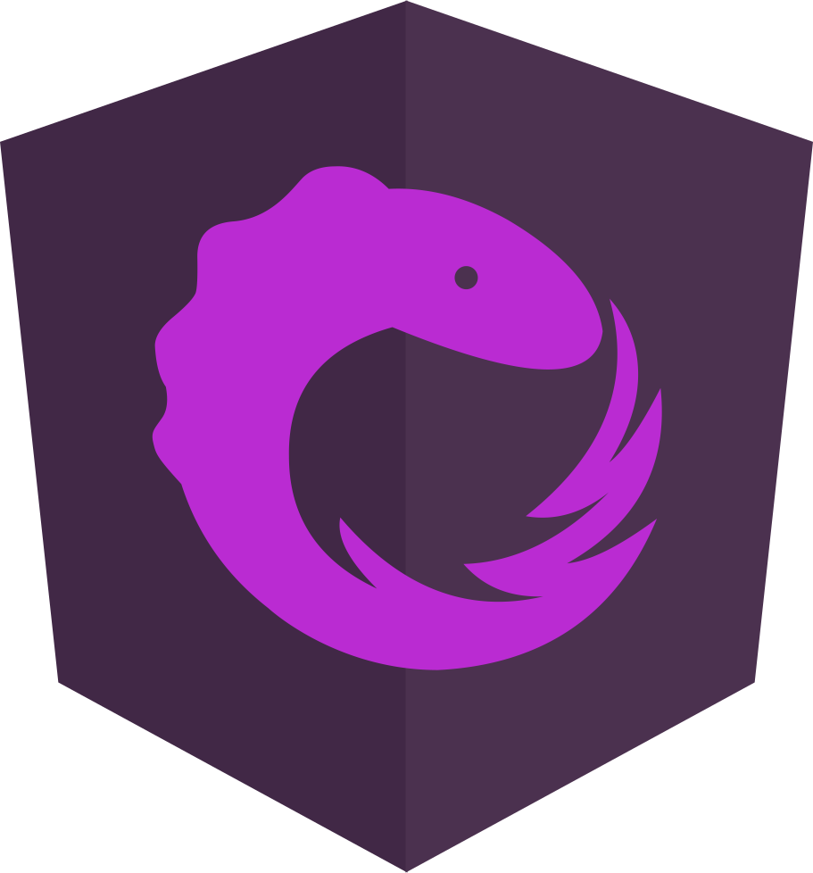

<h1 align="center">QQ音乐[Angular7.x + NGRX]</h1>

<p align="center">
    
    
    
    
    
</p>


## Development server【开发环境】

Run `ng serve` OR `npm start` for a dev server. Navigate to `http://localhost:4200/`. The app will automatically reload if you change any of the source files.

Run `ng serve --host ip` custom ip address. eg: `ng serve --host 192.168.0.109`,Navigate to `http://192.168.0.109:4200/`.

## Code scaffolding

Run `ng generate component component-name` to generate a new component. You can also use `ng generate directive|pipe|service|class|guard|interface|enum|module`.

## Build

Run `ng build` to build the project. The build artifacts will be stored in the `dist/` directory. Use the `--prod` flag for a production build.

## Running unit tests

Run `ng test` to execute the unit tests via [Karma](https://karma-runner.github.io).

## Running end-to-end tests

Run `ng e2e` to execute the end-to-end tests via [Protractor](http://www.protractortest.org/).

## Product server【正式环境】

Run `npm run build:ssr && npm run serve:ssr`

Run `npm run start:pro` Run with PM2 `pm2 start dist/server`

## Create Components
Run `ng g c new-component --module app`

## For another place to route to, create a second feature module with routing
Run `ng generate module orders --routing` AND `ng generate module customers --routing`

## 生成 `Action` `Reducer` `Effect`
Run `ng generate action ../store/search --group`

Run `ng generate effect ../store/search --group`

Run `ng generate reducer ../store/search --group --spec false`

## Directory structure【目录结构】

```bash
├── app //组件
│   ├── common  //公共组件
│   │   ├── big-card
│   │   ├── headline
│   │   ├── scroll
│   │   ├── slider
│   │   └── small-card
│   ├── controller
│   ├── details
│   │   ├── cover
│   │   └── list-content
│   ├── helpers //公共函数
│   ├── hot
│   ├── list
│   ├── my-counter
│   ├── navbar
│   ├── portal
│   │   └── banner
│   ├── profile
│   ├── search
│   │   ├── hot-search
│   │   ├── search-input
│   │   └── search-list
│   └── smile
├── assets  //静态资源
│   └── imgs
│       ├── audio
│       ├── icon
```